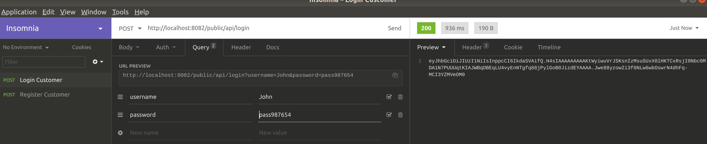

https://medium.com/@pradeep_thomas/persistence-redefined-using-spring-boot-and-a-single-api-72f3bfd5d160

https://start.spring.io/

## Register a User

HTTP POST

http://localhost:8082/public/api/register?username=John&password=pass987654

  

## Login a user

HTTP POST

http://localhost:8082/public/api/login?username=John&password=pass987654

  

